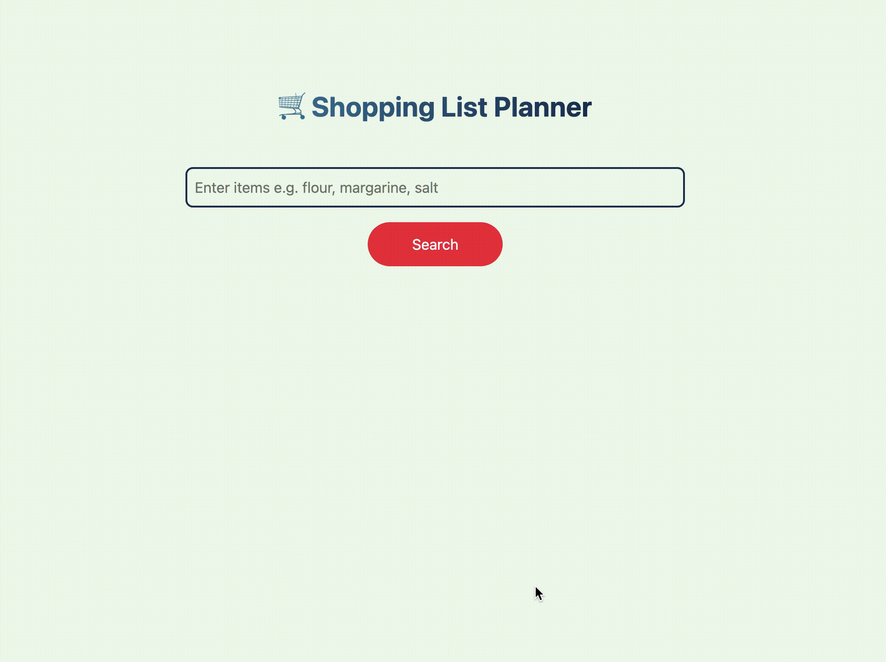

# Grocery Shopping List Planner 🛒

[](https://reactjs.org/)
[](https://www.typescriptlang.org/)
[](https://tailwindcss.com/)
[](https://fusejs.io/)

A **React + TypeScript + Tailwind** web app that lets users plan their grocery shopping.
Type a shopping list, see **best product matches**, explore **similar alternatives**, and calculate the **total price dynamically**.

 

---

## Features ✨

* **Fuzzy search** for handling typos and partial matches
* **Best match first**, with expandable list of similar products
* **Substitute products** to update totals dynamically
* **Responsive UI** for mobile and desktop

---

## Quick Start 🚀

```bash
git clone https://github.com/panasheMuriro/GroceryPlanner.git
cd GroceryPlanner
npm install
npm start
```

Open your browser at `http://localhost:3000`.

---

## Usage 📝

1. Enter items in the input field (comma-separated).
2. Click **Search** to see the best matches.
3. Expand **“See similar items”** to explore alternatives.
4. Click a product to replace the best match and update the total price.

---

## Product Data 📦

Products are imported from a JSON file (`results.json`), example:

```json
{
  "title": "RED SEAL IODISED SALT 1KG",
  "image": "https://cdn.spar.co.zw/data/625-Thumb.jpg",
  "price": "USD$0.46"
}
```

---

## Tech Stack 🛠️

* **React** + **TypeScript**
* **TailwindCSS**
* **Fuse.js** for fuzzy search

---

## Future Improvements 🔮

* Support **quantities** (e.g., `2x salt`) with updated totals
* Fetch **live prices** from an API
* Category filtering and sorting
* Animations and better mobile UX

---
